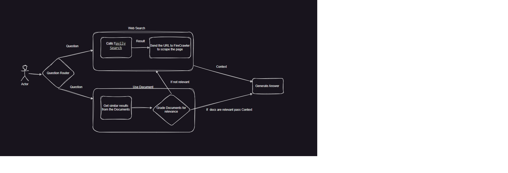
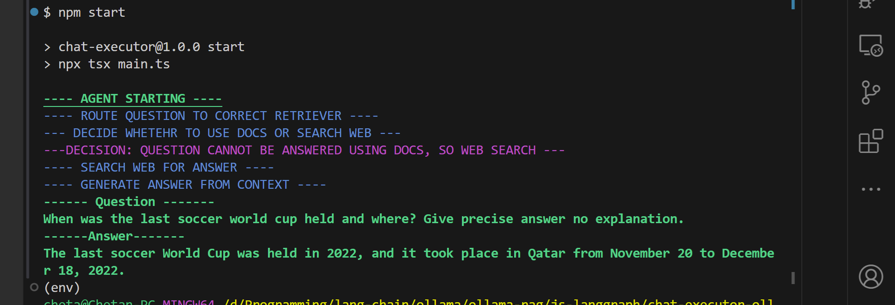
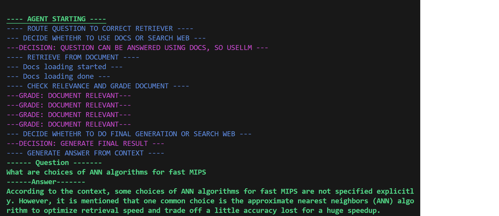

# Ollama + LangraphJs Agents

Tried out the capability of Langhgraph with Ollama, and built a rag agent, with different state. Its like State Machine, where each state can transition into a different state on certain actions.

### App Dependency

We depend on following packages that would need us to create account and get API keys.
The packages are:

- [FireCrawler](https://www.firecrawl.dev/) - For parsing the web page in a format that is well suited for LLMs.
- [Tavily](https://tavily.com/) - Search tool to search web for content.
- [Open AI](https://openai.com/) - To use the embedding generation.

After we have an account in the above sites, let's update the `.env.example` file with the API keys and rename it to `.env`.

### Local Development

After we have the `.env` file updated we need to run `npm install` to install the dependencies. After that we can start the agent with `npm start`.
The `question` to the chat agent is hard coded in the `main.ts` for now.
**_Make sure you have Ollama server running locally._**

### What do we have ?

The Agent consist of following .
The State Graph has 4 states:

- Routing - The starting stage where we route the question to correct chain.
- Web Search - In this state we search the web for the answer.
- Retrieve Document(Use LLM) - Here we search the embedded document for relevant answer.
- Grade Documents - Here we grade the generated paragraphs from the embedded documents for relevance.
- Generate From Context - The last state is to generate a result from the context generated from previous steps(Web Search or Embedded Documents).

#### Screenshots

Here is what the 2 flows will output

- Web Search
  .

- Using Document
  .
